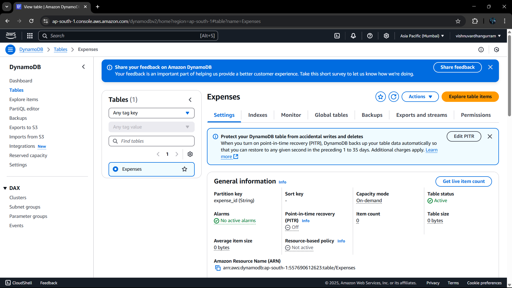
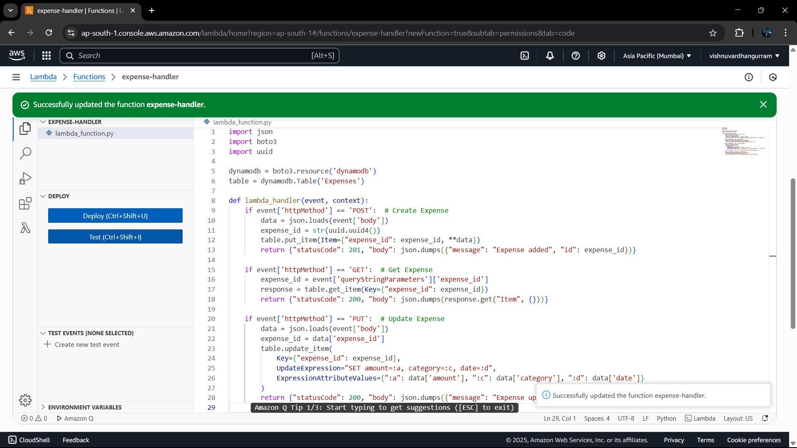
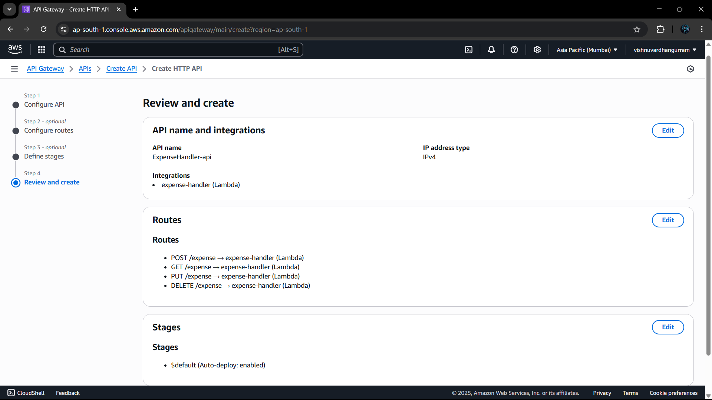
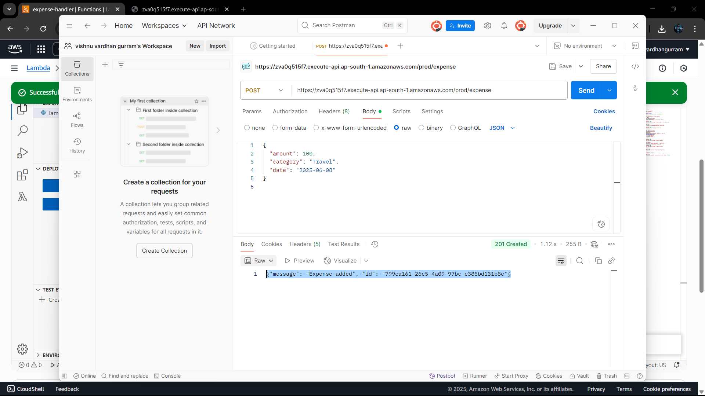

# 💸 Serverless Expense Tracker on AWS

This is a fully functional **serverless backend application** built on AWS using Lambda, DynamoDB, and API Gateway. It performs **CRUD operations** on expenses (Create, Read, Update, Delete) without managing servers.

---

## 🔧 Tech Stack

- 🧠 **Backend**: AWS Lambda (Python)
- 🌐 **API Gateway**: HTTP API for RESTful access
- 🗂️ **Database**: Amazon DynamoDB (NoSQL)
- 💡 **Frontend (Optional)**: HTML, CSS, and JavaScript

---

## 📸 Screenshots

| Step | Image |
|------|-------|
| 1. DynamoDB Table Setup |  |
| 2. Lambda Function Code |  |
| 3. API Gateway Routes |  |
| 4. Testing with Postman |  |
| 5. CloudWatch Logs |  |
| 6. Optional Frontend |  |

> 📁 Put your screenshot files inside a folder named `/images/` inside your GitHub repo.

---

## 🚀 How It Works

### ▶️ 1. Create DynamoDB Table
- Table name: `Expenses`
- Primary Key: `expense_id` (String)
- Capacity Mode: On-Demand


### ⚙️ 2. Lambda Function (Python 3.x)
- Handles `POST`, `GET`, `PUT`, `DELETE`
- Interacts with DynamoDB using `boto3`


### 🌐 3. API Gateway Setup
- HTTP API
- 4 Routes: `/expense` with `POST`, `GET`, `PUT`, `DELETE`
- Each route integrated with the Lambda function

[API Routes](images/api_gateway_routes.png)
---

## 🧪 Testing the API

You can test the API using Postman or curl:

```bash
POST /expense
{
  "amount": 200,
  "category": "Groceries",
  "date": "2025-06-08"
}


